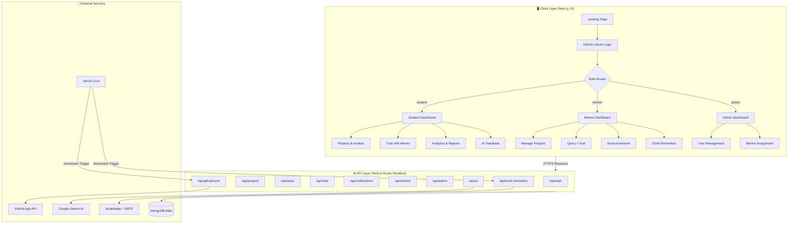
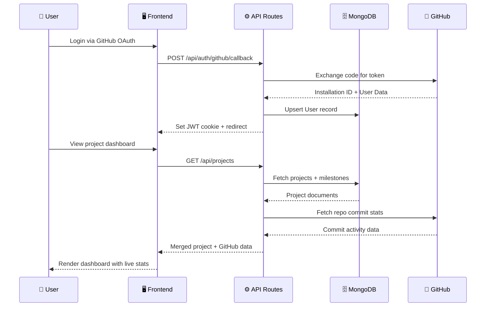
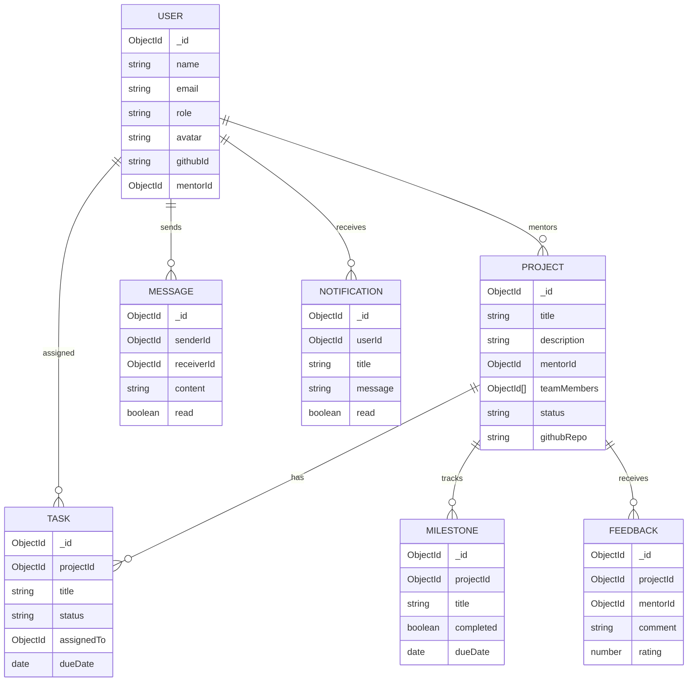

<div align="center">


<br/>

[](https://nextjs.org/)
[](https://www.typescriptlang.org/)
[](https://mongodb.com/)
[](https://tailwindcss.com/)
[](https://github.com)
[](https://vercel.com)
[](https://ai.google.dev/)

<br/>

> **Flux** is a blazing-fast, AI-powered student project tracking platform built for academic institutions. It combines real-time GitHub integration, intelligent mentorship workflows, and beautiful analytics — all in one place.

<br/>

[🚀 Quick Start](#-quick-start) · [🏗️ Architecture](#️-system-architecture) · [✨ Features](#-features) · [📡 API](#-api-reference) · [🗄️ Schema](#️-database-schema) · [🤝 Team](#-team)

</div>

---

## ✨ Features

<table>
<tr>
<td width="50%">

### 👨‍🎓 Student Experience
- 📋 View assigned projects & milestones
- ✅ Drag-and-drop task Kanban board
- 💬 Real-time chat with mentor
- 📊 Personal performance analytics
- 🔔 Smart notifications
- 🤖 AI-powered code feedback

</td>
<td width="50%">

### 🧑‍🏫 Mentor Experience
- 🏗️ Create & manage projects
- 📣 Broadcast announcements
- 📨 Send targeted email reminders
- 🌟 Submit structured feedback & ratings
- 📈 Monitor student GitHub activity
- 🗂️ Milestone tracking

</td>
</tr>
<tr>
<td width="50%">

### 🛡️ Admin Experience
- 👥 Full user & role management
- 🧑‍💼 Assign & manage mentors
- 📋 Platform-wide oversight
- 🔧 System administration panel

</td>
<td width="50%">

### ⚡ Platform Highlights
- 🔗 GitHub App integration (commits, PRs, repos)
- 🤖 Google Gemini AI code analysis
- 🌙 Dark mode + responsive design
- 🔐 GitHub OAuth authentication
- ⏰ Scheduled cron jobs for sync
- 📄 AI-generated project PDF reports

</td>
</tr>
</table>

---

## 🏗️ System Architecture



---

## 🗂️ Data Flow



---

## 🚀 Quick Start

### Prerequisites

| Requirement | Version |
|---|---|
| Node.js | `18+` |
| MongoDB Atlas | Any |
| GitHub App | Configured |

### Installation

```bash
# 1. Clone the repository
git clone https://github.com/Yash-Bharvada/Student_Progress.git
cd Student_Progress

# 2. Install dependencies
npm install

# 3. Configure environment
cp .env.local.template .env.local
# Fill in your credentials (see Environment Variables below)

# 4. Seed the admin account
node scripts/seed-admin.js

# 5. Start the dev server
npm run dev
```

Visit **[http://localhost:3000](http://localhost:3000)** 🎉

---

## 📁 Project Structure

```
flux/
├── 📂 app/
│   ├── 📂 api/                    # 21 API route handlers
│   │   ├── auth/                  # GitHub OAuth flow
│   │   ├── projects/              # Project CRUD + team + milestones
│   │   ├── tasks/                 # Task management
│   │   ├── chat/                  # Real-time messaging
│   │   ├── notifications/         # Push notifications
│   │   ├── mentor/                # Announcements + reminders
│   │   ├── admin/                 # User & mentor management
│   │   ├── ai/                    # Gemini AI analysis
│   │   ├── github/sync            # GitHub data sync
│   │   └── send-reminders/        # Email dispatch
│   ├── dashboard/                 # Student home
│   ├── projects/                  # Project views + AI report
│   ├── students/                  # Student chat
│   ├── mentor/                    # Mentor panel
│   └── admin/                     # Admin panel
│
├── 📂 components/
│   ├── app-sidebar.tsx            # Role-aware navigation
│   ├── notifications-popover.tsx  # Live notifications
│   ├── project-detail-dialog.tsx  # Full project view
│   └── ui/                        # Shadcn/UI primitives
│
├── 📂 lib/
│   ├── models/                    # 10 Mongoose models
│   ├── auth.ts                    # JWT + session logic
│   ├── github.ts                  # GitHub API client
│   ├── gemini.ts                  # AI integration
│   └── notifications.ts           # Notification helpers
│
└── 📂 scripts/
    ├── seed-admin.js              # Bootstrap admin user
    └── clear-db.js               # Reset database
```

---

## 🗄️ Database Schema



---

## 📡 API Reference

<details>
<summary><b>🔐 Authentication</b></summary>

| Method | Endpoint | Description |
|--------|----------|-------------|
| `GET` | `/api/auth/github` | Initiate GitHub OAuth |
| `GET` | `/api/auth/github/callback` | OAuth callback handler |
| `POST` | `/api/auth/logout` | Destroy session |
| `GET` | `/api/user` | Get current user |

</details>

<details>
<summary><b>📋 Projects</b></summary>

| Method | Endpoint | Description |
|--------|----------|-------------|
| `GET` | `/api/projects` | List all projects |
| `POST` | `/api/projects` | Create project |
| `GET` | `/api/projects/:id` | Get project details |
| `PUT` | `/api/projects/:id` | Update project |
| `GET` | `/api/projects/:id/milestones` | Get milestones |
| `GET` | `/api/projects/:id/feedback` | Get feedback |
| `GET` | `/api/projects/:id/report` | Generate AI report |

</details>

<details>
<summary><b>💬 Chat & Notifications</b></summary>

| Method | Endpoint | Description |
|--------|----------|-------------|
| `GET` | `/api/chat/:userId` | Get messages with user |
| `POST` | `/api/chat/send` | Send a message |
| `GET` | `/api/notifications` | List notifications |
| `PATCH` | `/api/notifications` | Mark as read |

</details>

<details>
<summary><b>🛡️ Admin</b></summary>

| Method | Endpoint | Description |
|--------|----------|-------------|
| `GET` | `/api/admin/users` | List all users |
| `PUT` | `/api/admin/users/:id/role` | Change user role |
| `GET` | `/api/admin/mentors` | List mentors |
| `GET` | `/api/admin/mentors/:id/details` | Mentor details |

</details>

---

## 🛠️ Tech Stack

| Layer | Technology | Purpose |
|-------|-----------|---------|
| **Framework** | Next.js 15 (App Router) | Full-stack React framework |
| **Language** | TypeScript 5 | Type safety |
| **Styling** | Tailwind CSS + Shadcn/UI | UI components |
| **Database** | MongoDB + Mongoose | Data persistence |
| **Auth** | GitHub OAuth + JWT | Secure sessions |
| **AI** | Google Gemini API | Code analysis & reports |
| **Email** | NodeMailer | Reminder emails |
| **Charts** | Recharts | Analytics visuals |
| **Deployment** | Vercel | Hosting + Cron jobs |
| **GitHub** | GitHub App API | Repo & commit data |

---

## 🔐 Environment Variables

```env
# Database
MONGODB_URI=mongodb+srv://...

# GitHub App
GITHUB_APP_ID=
GITHUB_CLIENT_ID=
GITHUB_CLIENT_SECRET=
GITHUB_PRIVATE_KEY=

# Auth
JWT_SECRET_KEY=

# AI
GEMINI_API_KEY=

# URLs
NEXT_PUBLIC_FRONTEND_URL=https://your-domain.com
```

> Copy `.env.local.template` and fill in your values.

---

## 🚢 Deployment

### One-click Vercel Deploy

```bash
npm install -g vercel
vercel --prod
```

### Cron Jobs (auto-configured via `vercel.json`)

| Job | Schedule | Purpose |
|-----|----------|---------|
| GitHub Sync | Every 6 hours | Pull latest commit data |
| Email Reminders | Daily 9 AM | Notify students of deadlines |

---

## 🤝 Team

<div align="center">

| 👤 | Role |
|---|---|
| **Yash Bharvada** | Full-Stack Developer |
| **CHARUSAT** | Institution |
| **TechGenius Hackathon** | Event |

</div>

---

<div align="center">

### ⭐ If Flux helped you, give it a star!


**Built with ❤️ for TechGenius Hackathon · CHARUSAT**

</div>
